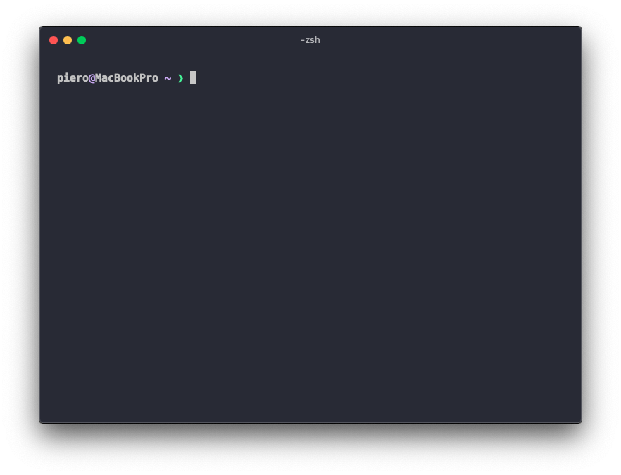

# `.dotfiles`

These are my dotfiles, a collection of configuration files for macOS.

## Terminal emulator

I've been using [wezterm](https://github.com/wez/wezterm) for a while now. It's a GPU-accelerated terminal emulator and multiplexer.

## The Shell

- [zsh](https://www.zsh.org/)
- [starship](https://starship.rs/) - A minimal shell prompt.
- [exa](https://github.com/ogham/exa) - A modern replacement for `ls`.
- [bat](https://github.com/sharkdp/bat) - A cat(1) clone with syntax highlighting and Git integration.
- [goto](https://github.com/iridakos/goto) - Easy navigation.

## Text editor

I'm currently using [neovim](https://github.com/neovim/neovim) for most of my text editing.

## Alacritty + tmux shotcuts

**Function** | **Shortcut**
-------- | --------
**Windows** | 
New Window | `⌘` + `T`
Close Pane or Window | `⌘` + `W`  (same as many mac apps)
Go to Window | `⌘` + `Number Key`  (ie: `⌘2` is 2nd tab)
**Splitting** | 
Split Window Vertically (same profile) | `⌘` + `D`
Split Window Horizontally (same profile) | `⌘` + `Shift` + `D`  (mnemonic: shift is a wide horizontal key)
**Moving** |
Move a pane with the mouse | `⌘` + `Shift` + `Direction` and then drag the pane from anywhere
Previous Window | `⌘`+ `Shift` + `[`
Next Window | `⌘`+ `Shift` + `]`
