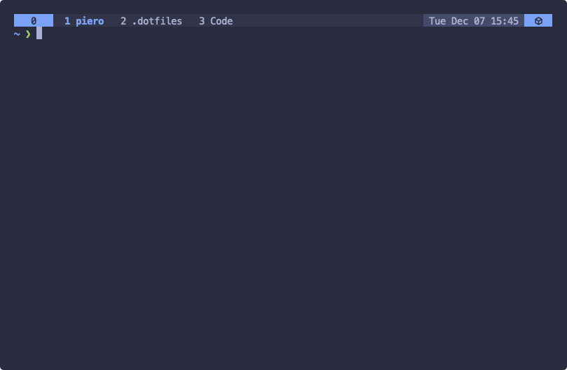

# `.dotfiles`

## Introduction

This repo contains my configuration files for macOS. I sometimes use Linux too but I always need to make some small modifications to make them work.

Remember that your dotfiles are how you personalize your system. If you want to give these a try first review the code and pick the parts you think might be useful.

I manage these file with GNU Stow. It makes it easier to create symlinks in your home directory.

## Shell | [zsh](https://www.zsh.org/)

### Some tools I use

- [starship](https://starship.rs/) - A minimal shell prompt.
- [exa](https://github.com/ogham/exa) - A modern replacement for `ls`.
- [bat](https://github.com/sharkdp/bat) - A cat(1) clone with syntax highlighting and Git integration.
- [jrnl](https://github.com/jrnl-org/jrnl) - Collect your thoughts and notes without leaving the command line.
- [goto](https://github.com/iridakos/goto) - Easy navigation.
- [neovim](https://github.com/neovim/neovim) - Vim-fork focused on extensibility and usability.

## Terminal Emulator | [tmux](https://github.com/tmux/tmux) + [alacritty](https://github.com/alacritty/alacritty)

Tmux is a powerful tool but the key commands are not intuitive and can also be hard to type. With Alacritty you can create custom keybindings that execute a sequence of keystrokes. This lets me configure commands similar to the ones that iTerm has.

I got this trick from [Josh Medeski](https://github.com/joshmedeski). For more details check [this video](https://www.youtube.com/watch?v=BLp61-Lq0kQ).

### Shortcuts

**Function** | **Shortcut**
-------- | --------
**Session** |
Rename the current tmux session | `⌘` + `.`
Open menu to select a tmux session | `⌘` + `K`
**Windows** | 
New Window | `⌘` + `T`
Close Pane or Window | `⌘` + `W`
Previous Window | `⌘`+ `Shift` + `[`
Next Window | `⌘`+ `Shift` + `]`
Rename the current tmux window | `⌘` + `,`
**Panes** | 
Split Window Vertically | `⌘` + `D`
Split Window Horizontally | `⌘` + `Shift` + `D`
Toggle the zoom state on current pane | `⌘` + `Z`
Move between panes | `⌘` + `Shift` + `Direction`

## License

The code is available under the [MIT License](LICENSE).
