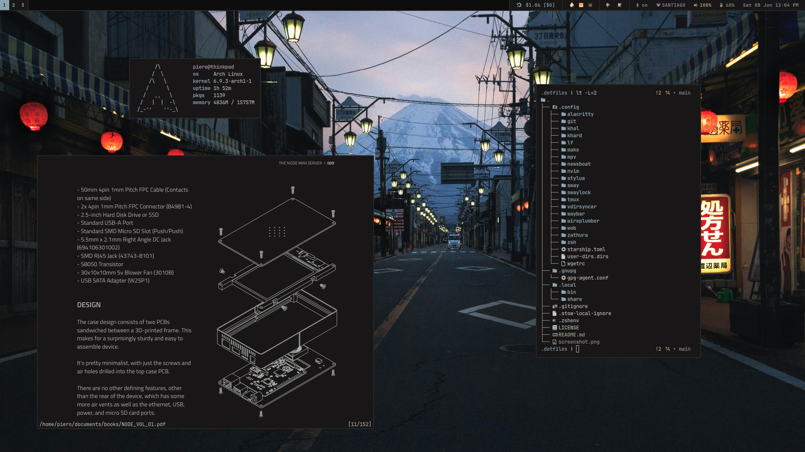

# `.dotfiles`

_Configuration files and scripts for my Arch Linux system._

## Specifications

* WM: [sway](https://github.com/swaywm/sway)
* Bar: [waybar](https://github.com/Alexays/Waybar)
* Terminal: [alacritty](https://github.com/alacritty/alacritty)
* Browser: [brave](https://brave.com/)
* Shell: [zsh](https://www.zsh.org/)
* Editor: [neovim](https://github.com/neovim/neovim)
* File manager: [lf](https://github.com/gokcehan/lf)
* PDF reader: [zathura](https://git.pwmt.org/pwmt/zathura)
* Notifications: [mako](https://github.com/emersion/mako)
* Launcher: [bemenu](https://github.com/Cloudef/bemenu) 
* Color scheme: [base16-kanagawa-theme](https://github.com/montdor/base16-kanagawa-theme)

## License

The code is available under the [MIT License](LICENSE).
